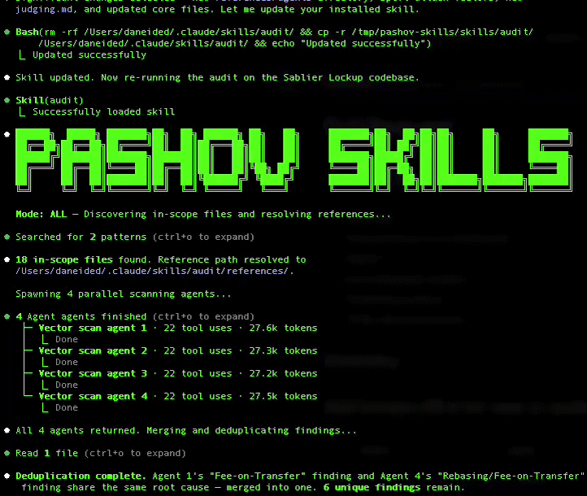

# Pashov Audit Group Skills

> Claude Code skills for Solidity security and development — built by [Pashov Audit Group](https://www.pashov.com/).

[](LICENSE)
[](CONTRIBUTING.md)

---

## Install & Run

Works with Claude Code in **VS Code**, **Cursor**, and the terminal. Clone this repo, then copy any skill folder into Claude Code's commands directory:

```bash
git clone https://github.com/pashov/skills.git
cp -r skills/<skill-name> ~/.claude/commands/<skill-name>
```

The skill is then invocable as `/<skill-name>` (e.g., `/audit`).

> **Tip:** Open a second terminal on the side, run the skill there, and keep coding in your main terminal.

---

## Skills

| Skill                  | Description                                                                     |
| ---------------------- | ------------------------------------------------------------------------------- |
| [audit](skills/audit/) | Fast (typically <5 min) security feedback on Solidity changes while you develop |

---

## See Pashov Skills in Action



---

## Contributing · Security · License

We welcome improvements and fixes. See [CONTRIBUTING.md](CONTRIBUTING.md) for the PR process.

Report vulnerabilities via [Security Policy](SECURITY.md). This project follows the [Contributor Covenant](CODE_OF_CONDUCT.md). [MIT](LICENSE) © contributors.

## Contact

For a Pashov Audit Group security engagement, reach out on [Telegram @pashovkrum](https://t.me/pashovkrum).
