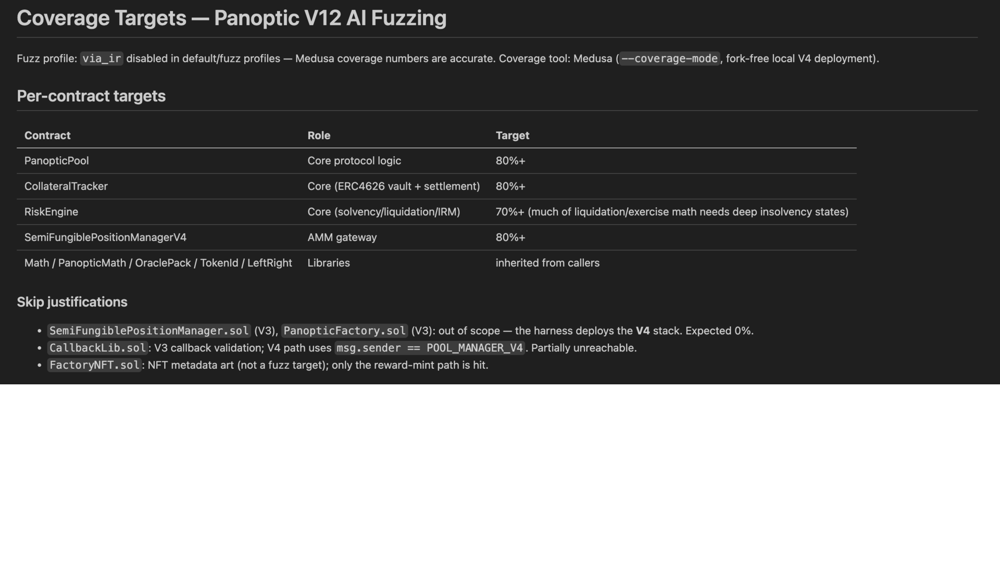

# Fizz

A full fuzz testing suite for your smart contracts in minutes, not weeks — works with any Foundry or Hardhat project, on both Echidna and Medusa.

Built for:

- **Solidity devs** who know they should fuzz but don't have weeks to set it up
- **Security researchers** who want a full suite generated in minutes, not days

## What You Get

One command produces:

| Output | What's Inside |
|--------|--------------|
| `test/fizz/` | Full harness — setup, handlers, and invariants in plain, editable Solidity |
| `PROPERTIES.md` | Every invariant in plain English, each with a stable ID and status |
| `Reproduction tests` | A deterministic Foundry test for each distinct violation found |
| `report.md` | Campaign summary — coverage reached and violations surfaced |

## Demo

_Part of a Fizz run shown below_



## Usage

```
Install https://github.com/pashov/skills/ and run fizz on the codebase
```

```
Generate a fuzz suite for this lending protocol. Focus on solvency and liquidation invariants.
```

```
update skill to latest version
```

## Tips

- **Run guided on first use.** Reviewing entry points and properties once shows exactly what the suite covers — then switch to automatic.
- **Keep it in sync.** After changing contracts, run `/fizz-sync` to update the suite instead of regenerating it.
- **Write properties in English.** Drop plain-English invariants into `PROPERTIES.md` and `/fizz-convert` turns them into Solidity.
- **Optionally, prove the core.** If the protocol has stateless math (conversions, previews, quotes) and the campaign is already clean, `--verify` builds a small proof harness and runs it through Echidna's verification mode, which answers for *every* input instead of sampling. It needs Echidna >= 2.4 and `bitwuzla`, it covers only single-transaction properties under stated bounds, and some properties will not resolve — see [references/symbolic-verification.md](references/symbolic-verification.md) before deciding it is worth the time. Everything else stays the fuzzer's job.
