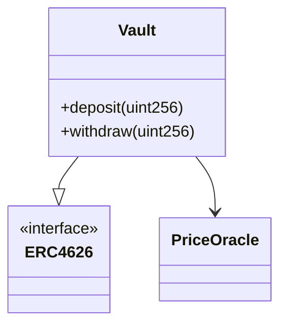
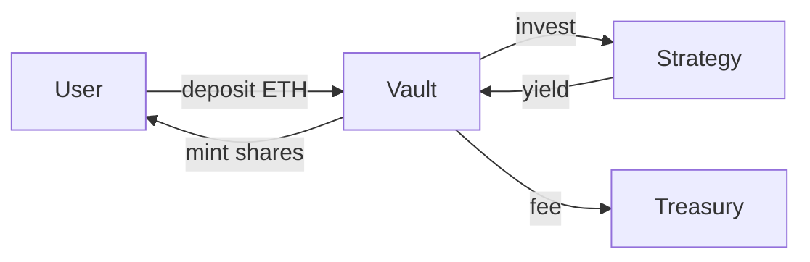

# Start Audit

<context>
## Context

This skill helps security researchers and auditors start an in-depth security review, understand the codebase and get up to speed fast. It builds the project, maps the architecture, traces token flows, documents external integrations, and produces a threat model - all as separate Mermaid-enhanced markdown files ready to hand off to an auditor.
</context>

<instructions>

## Workflow

### 1. Detect Toolchain

Check for `foundry.toml` (Foundry) or `hardhat.config.{js,ts}` (Hardhat) in the project root. If both exist, prefer Foundry. If neither exists, scan subdirectories one level deep.

### 2. Build the Project

**Foundry:**
```bash
forge build
```

**Hardhat:**
```bash
npm install  # or yarn install / pnpm install, based on lockfile
npx hardhat compile
```

Surface any compilation errors verbatim in the output. If the build fails, document the errors in `audit-helper/build-errors.md` and continue with static analysis - a failed build doesn't stop the rest of the workflow.

### 3. Discover Contracts

Read all `.sol` files under `src/`, `contracts/`, or wherever the toolchain config points. Build a mental map of:
- Contract names and their roles
- Inheritance chains
- Interfaces and libraries
- Which contracts are entry points vs. internals

### 4. Generate Deliverables

Produce all five files in an `audit-helper/` directory at the repo root. Run through each one in order.

---

## Deliverables

### `audit-helper/protocol-summary.md`

A plain-English description of the protocol. Cover:
- What the protocol does and who uses it
- Core invariants (what must always be true)
- Key parameters and their significance
- Roles and permissions (owner, admin, keeper, etc.)
- Upgrade patterns if any (proxy type, upgrade authority)
- Any notable design decisions or tradeoffs visible in the code

### `audit-helper/architecture.md`

A Mermaid diagram showing the contract structure, then a written explanation.

Show:
- All contracts as nodes
- Inheritance with `--|>` edges
- Composition/dependency with `-->` edges
- External contracts (oracles, tokens, routers) as distinct nodes



After the diagram, describe each contract's responsibility in 1-3 sentences.

### `audit-helper/flow-of-funds.md`

A Mermaid flowchart tracing how assets move, then a written explanation.

Cover every path where tokens or ETH enter, leave, or move between contracts:
- User deposits and withdrawals
- Fee collection and distribution
- Liquidations or settlements
- Emergency/pause paths



After the diagram, describe each flow in plain English, including any conditions or branching.

### `audit-helper/integrations.md`

Documents every external dependency. For each integration include:
- Protocol name and version (if determinable)
- Interface or contract address (if hardcoded)
- What the protocol relies on it for
- Trust assumptions made about it
- What breaks if it misbehaves (returns bad data, gets exploited, is paused)

Categories to check: price oracles, DEX routers, lending protocols, bridges, token standards (ERC20/721/1155 quirks), governance systems, and any raw `call`/`delegatecall` targets.

### `audit-helper/threat-model.md`

A structured threat model. Use this format:

**Assets** - What is there to steal or break?
- List tokens held, governance power, privileged roles, protocol reputation

**Actors** - Who interacts with the protocol?
- For each: name, capabilities, trust level (trusted / semi-trusted / untrusted)

**Trust Boundaries** - Where does trust change?
- User → contract, contract → external protocol, owner → contract, etc.

**Attack Surfaces** - What can an attacker touch?
- Public/external functions, constructor args, admin functions, oracle inputs, callback hooks

**Threat Scenarios** - What are the realistic attacks?
- For each scenario: attacker type, preconditions, attack vector, potential impact (funds lost / protocol bricked / governance captured / etc.)

Derive scenarios from what the code actually does - don't pad with generic threats.

</instructions>

<output_format>
## Output Format

After generating all five files, print a summary:

```
## Audit Prep Complete

Build: ✅ success  (or ❌ failed - see audit-helper/build-errors.md)

Generated:
- audit-helper/protocol-summary.md
- audit-helper/architecture.md
- audit-helper/flow-of-funds.md
- audit-helper/integrations.md
- audit-helper/threat-model.md

[2-3 sentence snapshot of what the protocol does and the most notable things an auditor should focus on first]
```

</output_format>

<constraints>
## Constraints

- Prefer reading actual code over guessing. If you're unsure what a function does, read it.
- Mermaid diagrams should be accurate, not decorative. Only include nodes and edges that reflect real code relationships.
- If the repo is large, prioritize core protocol contracts over periphery, scripts, and test helpers.
- Flag anything unusual - weird patterns, commented-out code, TODOs, hardcoded addresses - in the protocol summary.
</constraints>
