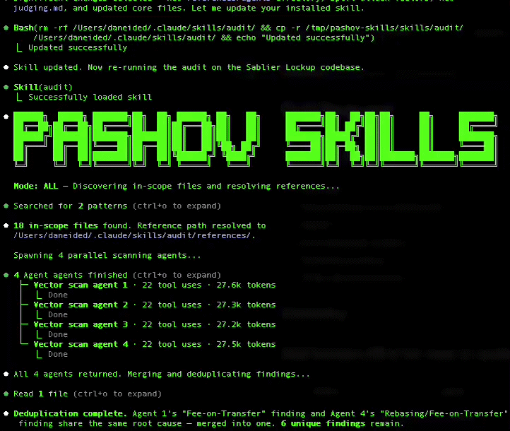

# Solidity Auditor

A security agent with a simple mission - findings in minutes, not weeks.

Built for:

- **Solidity devs** who want a security check before every commit
- **Security researchers** looking for fast wins before a manual review
- **Just about anyone** who wants an extra pair of eyes.

Not a substitute for a formal audit - but the check you should never skip.

## Demo

_Portrayed below: finding multiple high-confidence vulnerabilities in a codebase_



## Usage

```
Install https://github.com/pashov/skills/ and run solidity auditor on the codebase
```

```
run solidity auditor on *specified files*
```

```
update skill to latest version
```

## Scope Rules

`solidity-auditor` must treat the **entire target folder tree** as in scope unless the user explicitly narrows it.

That includes bundle-style runtime artifacts such as:
- `main-project/`
- `related-contracts/`
- `abi/`
- `bytecode/`
- `decompiled/`
- `project.json`
- `contract-list.json`
- `contract-variables.json`

Reading only `src/` or `contracts/` is not sufficient when the bundle contains runtime metadata, proxy mappings, bytecode-only siblings, or related-contract families.

## Bundle Closure

When auditing extracted bundles, the auditor should:
- inventory every file at least into an artifact family bucket
- classify runtime-relevant families as source-backed, abi-only, bytecode-only, proxy-only, decompiled, or runtime-metadata
- keep unresolved runtime-relevant siblings visible in the report instead of silently dropping them
- stop and ask for the missing artifact when a critical value path depends on a bytecode-only or unresolved dependency

If the bundle contains bytecode-only artifacts, that is **not** the same as a missing artifact. The correct status is:

- `bytecode-only artifact present`

## Tips

- **Use narrow scope only when the user asks for it.** Default mode is full bundle closure, not “just the hot contracts”.
- **Do not drop sibling runtime artifacts.** `abi/`, `bytecode/`, `related-contracts/`, and manifest files can change exploitability even when the main Solidity source looks straightforward.
- **Run more than once.** LLM output is non-deterministic — each run can surface different vulnerabilities. Two or three passes over the same code often catch things a single pass misses.
