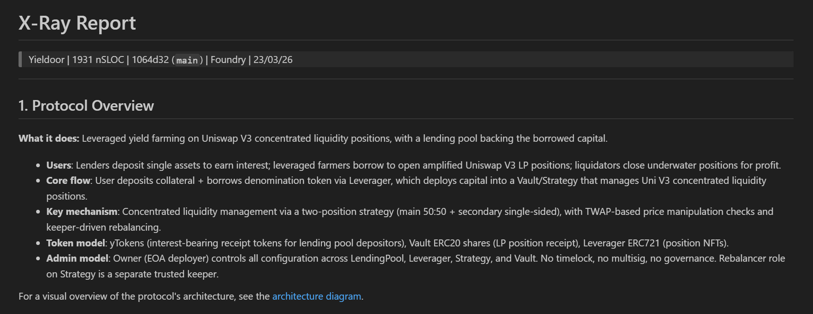

# X-Ray

Know your protocol before auditors do.

Built for:

- **Protocol teams** preparing for an audit — fix the obvious so auditors can focus on what matters
- **Security researchers** starting a new engagement — get the full picture in minutes

Not a vulnerability scanner — it is the aggressive mechanism map you read before opening the first file. It should identify the code paths, trust boundaries, accounting asymmetries, and live-state assumptions most likely to hide exploitable bugs.

## What You Get

One command produces:

| Output | What's Inside |
|--------|--------------|
| `x-ray.md` | Protocol overview, threat model, prioritized attack surfaces, test gaps, git history, readiness verdict |
| `entry-points.md` | Every state-changing function classified by access level with call chains |
| `invariants.md` | Full invariant map — enforced guards, single-contract invariants, cross-contract trust assumptions, and higher-order economic properties |
| `architecture.svg` | Visual architecture diagram — contracts, actors, trust boundaries |

## Demo

_Part of an X-Ray report generation shown below_



## Usage

```
Install latest https://github.com/pashov/skills/ and run x-ray on the codebase
```

## Tips

- **Start with Key Attack Surfaces.** They should name concrete mechanisms, not vague prompts.
- **Use entry-points.md as your call map.** Start with permissionless value-moving functions and transfer hooks.
- **Use invariants.md as your falsification map.** `On-chain=No` blocks and cross-contract assumptions are the highest-signal audit leads.
